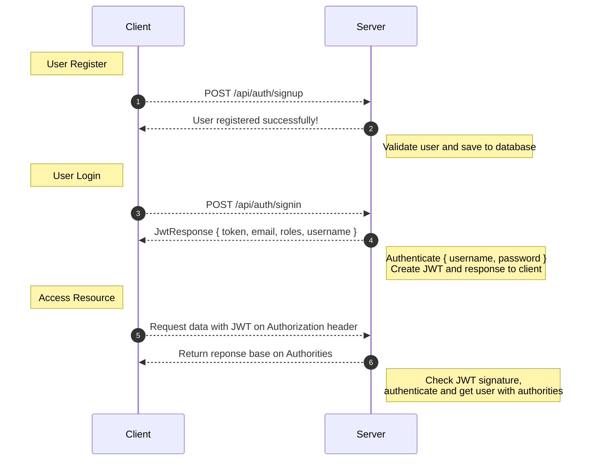
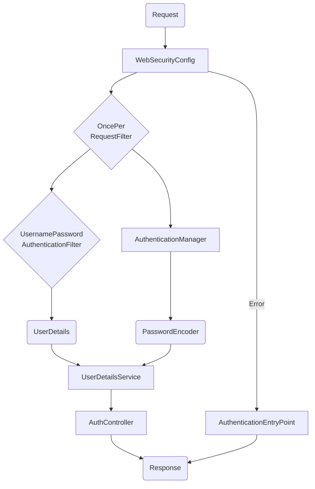

# Spring Boot JWT Authentication with PostgreSQL

## Technologies

- [Java 17.0.7](https://www.oracle.com/java/technologies/downloads/#java17)
- [Maven 3.9.4](https://maven.apache.org/download.cgi)
- [PostgreSQL 13.11](https://www.postgresql.org/download/)
- [Eclipse](https://eclipseide.org/)
- [Spring Tools Suite 4](https://spring.io/tools)
- [Spring Initilizer](https://start.spring.io/#!type=maven-project&language=java&platformVersion=3.1.2&packaging=jar&jvmVersion=17&groupId=com.tutorial&artifactId=security&name=security&description=Tutorial%20project%20for%20Spring%20Boot%20Security&packageName=com.tutorial.security&dependencies=lombok,web)

<!-- Spring Boot 3 / 2 (with Spring Security, Spring Web, Spring Data JPA) -->
<!-- jjwt-api 0.11.5 -->

## Authentication End Point
| Methods | Urls | Actions |
|-|-|-|
| POST | /api/auth/signup | Register new account |
| POST | /api/auth/signin | Login an account |
| GET |	/api/test/all | Access Public content |
| GET |	/api/test/user | Access User's content |
| GET |	/api/test/visitor | Access Visitor's content |
| GET | /api/test/editor | Access Editor's content |
| GET | /api/test/admin | Access Admin's content |

### Project Structure
```bash
.
├── src
│   ├── main
│   │   ├── java
│   │   │   └── com
│   │   │       └── tutorial
│   │   │           └── security
│   │   │               ├── auth
│   │   │               │   ├── jwt
│   │   │               │   │   ├── AuthEntryPointJwt.java
│   │   │               │   │   ├── AuthTokenFilter.java
│   │   │               │   │   └── JwtUtils.java
│   │   │               │   └── WebSecurityConfig.java
│   │   │               ├── controllers
│   │   │               │   ├── AuthController.java
│   │   │               │   ├── TestController.java
│   │   │               │   └── UserController.java
│   │   │               ├── models
│   │   │               │   ├── Role.java
│   │   │               │   └── User.java
│   │   │               ├── payloads
│   │   │               │   ├── request
│   │   │               │   │   ├── LoginRequest.java
│   │   │               │   │   └── SignupRequest.java
│   │   │               │   └── response
│   │   │               │       ├── JwtResponse.java
│   │   │               │       └── MessageResponse.java
│   │   │               ├── repositories
│   │   │               │   ├── RoleRepository.java
│   │   │               │   └── UserRepository.java
│   │   │               ├── services
│   │   │               │   ├── UserDetailsImpl.java
│   │   │               │   ├── UserDetailsService.java
│   │   │               │   ├── UserDetailsServiceImpl.java
│   │   │               │   ├── UserRoleService.java
│   │   │               │   └── UserRoleServiceImpl.java
│   │   │               ├── SecurityApplication.java
│   │   │               └── SecurityApplicationCLI.java
│   │   └── resources
│   │       ├── static
│   │       ├── templates
│   │       └── application.properties
│   └── test
│       └── java
│           └── com
│               └── tutorial
│                   └── security
│                       └── SecurityApplicationTests.java
├── .gitignore
├── HELP.md
├── README.md
├── mvnw
├── mvnw.cmd
├── pom.xml
└── security.iml

24 directories, 31 files
```


### Spring Boot Authentication Flow




### Spring Boot Security Architecture



– **WebSecurityConfig** is the core of our security implementation. It configures cors, csrf, session management, rules for protected resources. We can also extend and customize the default configuration that contains the elements below.

– **UserDetailsService** interface has a method to load User by username and returns a UserDetails object that Spring Security can use for authentication and validation.

– **UserDetails** contains necessary information (such as: username, password, authorities) to build an Authentication object.

– **UsernamePasswordAuthenticationToken** gets {username, password} from login Request, AuthenticationManager will use it to authenticate a login account.

– **AuthenticationManager** has a DaoAuthenticationProvider (with help of UserDetailsService & PasswordEncoder) to validate UsernamePasswordAuthenticationToken object. If successful, **AuthenticationManager** returns a fully populated Authentication object (including granted authorities).

– **OncePerRequestFilter** makes a single execution for each request to our API. It provides a doFilterInternal() method that we will implement parsing & validating JWT, loading User details (using UserDetailsService), checking Authorizaion (using UsernamePasswordAuthenticationToken).

– **AuthenticationEntryPoint** will catch authentication error.

– **Repository** contains **UserRepository** & **RoleRepository** to work with Database.

– **Controller** receives and handles request after it was filtered by OncePerRequestFilter.

  + **AuthController** handles authenication with jwt requests
  + **TestController** has accessing protected resource methods with role based validations.


## Implementation

### Setup new Spring Boot project

Use [Spring Initilizer](https://start.spring.io) or IDE ([Spring Tools Suite](https://spring.io/tools), [Eclipse](https://eclipseide.org), [Intellij](https://www.jetbrains.com/idea/download)) to create a Spring Boot project.


#### Add dependencies


```xml
    <dependency>
        <groupId>org.springframework.boot</groupId>
        <artifactId>spring-boot-starter-web</artifactId>
    </dependency>
    <dependency>
        <groupId>org.springframework.boot</groupId>
        <artifactId>spring-boot-starter-data-jpa</artifactId>
    </dependency>
    <dependency>
        <groupId>org.springframework.boot</groupId>
        <artifactId>spring-boot-starter-security</artifactId>
    </dependency>
    <dependency>
        <groupId>org.springframework.boot</groupId>
        <artifactId>spring-boot-starter-validation</artifactId>
    </dependency>
    <dependency>
        <groupId>io.jsonwebtoken</groupId>
        <artifactId>jjwt-api</artifactId>
        <version>0.11.5</version>
    </dependency>
    <dependency>
        <groupId>io.jsonwebtoken</groupId>
        <artifactId>jjwt-impl</artifactId>
        <version>0.11.5</version>
        <scope>runtime</scope>
    </dependency>
    <dependency>
        <groupId>io.jsonwebtoken</groupId>
        <artifactId>jjwt-jackson</artifactId>
        <version>0.11.5</version>
        <scope>runtime</scope>
    </dependency>

    <dependency>
        <groupId>org.projectlombok</groupId>
        <artifactId>lombok</artifactId>
        <optional>true</optional>
    </dependency>
    <dependency>
        <groupId>org.postgresql</groupId>
        <artifactId>postgresql</artifactId>
        <scope>runtime</scope>
    </dependency>
    <dependency>
        <groupId>org.springframework.boot</groupId>
        <artifactId>spring-boot-starter-test</artifactId>
        <scope>test</scope>
    </dependency>
```


#### Configure Spring Datasource, JPA, App properties

https://github.com/ravuthz/spring-boot-security/blob/fadef77ac5e1144f981e0c1e77f0537a51d416b8/src/main/resources/application.properties#L1-L16

```bash=
# application.properties

spring.datasource.url=jdbc:postgresql://localhost:5432/spring_security
spring.datasource.username=adminz
spring.datasource.password=123123
spring.jpa.properties.hibernate.dialect = org.hibernate.dialect.PostgreSQLDialect
spring.jpa.hibernate.ddl-auto = update
spring.jpa.show-sql=false

```

#### Create the models

User.java
https://github.com/ravuthz/spring-boot-security/blob/fadef77ac5e1144f981e0c1e77f0537a51d416b8/src/main/java/com/tutorial/security/models/User.java#L1-L53

Role.java
https://github.com/ravuthz/spring-boot-security/blob/fadef77ac5e1144f981e0c1e77f0537a51d416b8/src/main/java/com/tutorial/security/models/Role.java#L1-L25

#### Create the reposiotories

UserRepository.java
https://github.com/ravuthz/spring-boot-security/blob/fadef77ac5e1144f981e0c1e77f0537a51d416b8/src/main/java/com/tutorial/security/repositories/UserRepository.java#L1-L14

RoleRepository.java
https://github.com/ravuthz/spring-boot-security/blob/fadef77ac5e1144f981e0c1e77f0537a51d416b8/src/main/java/com/tutorial/security/repositories/RoleRepository.java#L1-L12

#### Configure Spring Security

WebSecurityConfig.java
https://github.com/ravuthz/spring-boot-security/blob/fadef77ac5e1144f981e0c1e77f0537a51d416b8/src/main/java/com/tutorial/security/auth/WebSecurityConfig.java#L1-L90

#### Implement UserDetails & UserDetailsService

UserDetailsImpl.java
https://github.com/ravuthz/spring-boot-security/blob/fadef77ac5e1144f981e0c1e77f0537a51d416b8/src/main/java/com/tutorial/security/services/UserDetailsImpl.java#L1-L93

UserDetailsService.java
https://github.com/ravuthz/spring-boot-security/blob/fadef77ac5e1144f981e0c1e77f0537a51d416b8/src/main/java/com/tutorial/security/services/UserDetailsService.java#L1-L8

UserDetailsServiceImpl.java
https://github.com/ravuthz/spring-boot-security/blob/fadef77ac5e1144f981e0c1e77f0537a51d416b8/src/main/java/com/tutorial/security/services/UserDetailsServiceImpl.java#L1-L24

#### Implement User and Role Service

UserRoleService.java
https://github.com/ravuthz/spring-boot-security/blob/fadef77ac5e1144f981e0c1e77f0537a51d416b8/src/main/java/com/tutorial/security/services/UserRoleService.java#L1-L13

UserRoleServiceImpl.java
https://github.com/ravuthz/spring-boot-security/blob/fadef77ac5e1144f981e0c1e77f0537a51d416b8/src/main/java/com/tutorial/security/services/UserRoleServiceImpl.java#L1-L41

#### Implement the Filter Requests

AuthTokenFilter.java
https://github.com/ravuthz/spring-boot-security/blob/fadef77ac5e1144f981e0c1e77f0537a51d416b8/src/main/java/com/tutorial/security/auth/jwt/AuthTokenFilter.java#L1-L57

#### Create JWT Utility class

JwtUtils.java
https://github.com/ravuthz/spring-boot-security/blob/fadef77ac5e1144f981e0c1e77f0537a51d416b8/src/main/java/com/tutorial/security/auth/jwt/JwtUtils.java#L1-L61

#### Implement the Authentication Exception

AuthEntryPointJwt.java
https://github.com/ravuthz/spring-boot-security/blob/fadef77ac5e1144f981e0c1e77f0537a51d416b8/src/main/java/com/tutorial/security/auth/jwt/AuthEntryPointJwt.java#L1-L38

#### Define payloads for Spring RestController

LoginRequest.java
https://github.com/ravuthz/spring-boot-security/blob/fadef77ac5e1144f981e0c1e77f0537a51d416b8/src/main/java/com/tutorial/security/payloads/request/LoginRequest.java#L1-L13

SignupRequest.java
https://github.com/ravuthz/spring-boot-security/blob/fadef77ac5e1144f981e0c1e77f0537a51d416b8/src/main/java/com/tutorial/security/payloads/request/SignupRequest.java#L1-L26

JwtResponse.java
https://github.com/ravuthz/spring-boot-security/blob/fadef77ac5e1144f981e0c1e77f0537a51d416b8/src/main/java/com/tutorial/security/payloads/response/JwtResponse.java#L5

MessageResponse.java
https://github.com/ravuthz/spring-boot-security/blob/fadef77ac5e1144f981e0c1e77f0537a51d416b8/src/main/java/com/tutorial/security/payloads/response/MessageResponse.java#L1-L10

#### Create Spring Rest API Controllers

AuthController.java - Controller for Authentication
https://github.com/ravuthz/spring-boot-security/blob/fadef77ac5e1144f981e0c1e77f0537a51d416b8/src/main/java/com/tutorial/security/controllers/AuthController.java#L1-L100

TestController.java- Controller for testing Authorization
https://github.com/ravuthz/spring-boot-security/blob/fadef77ac5e1144f981e0c1e77f0537a51d416b8/src/main/java/com/tutorial/security/controllers/TestController.java#L1-L61

#### Create CLI applicaion for generate some testing data

SecurityApplicationCLI.java
https://github.com/ravuthz/spring-boot-security/blob/fadef77ac5e1144f981e0c1e77f0537a51d416b8/src/main/java/com/tutorial/security/SecurityApplicationCLI.java#L1-L79


### Running appliation via CLI

```bash

# Go to project directory
cd ~/Projects/spring-boot/security

# ./mvnw clean install
# ./mvnw spring-boot:run

mvn clean install
mvn spring-boot:run

# open http://localhost:8080/
curl http://localhost:8080/

```

